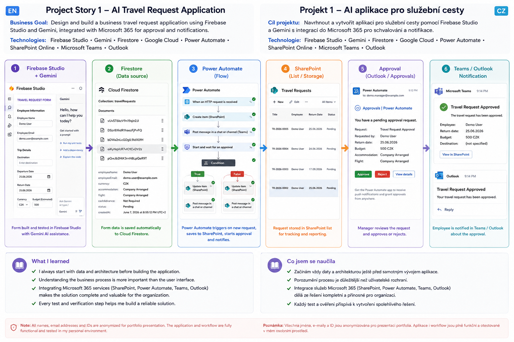

<!-- ========================================================= -->
<!-- README V2.0 -->
<!-- PART 1 -->
<!-- ========================================================= -->

<h1 align="center">
Hi, I'm Denisa Pitnerová 👋
</h1>

<p align="center">
Junior Microsoft 365 | SharePoint | Power Platform | AI & Business Automation
</p>

<p align="center">

</p>

<p align="center">
Building practical Microsoft 365 solutions through real projects, continuous learning and documentation.
<br>
Vytvářím praktická řešení postavená na Microsoft 365 prostřednictvím reálných projektů, průběžného učení a dokumentace.
</p>

---

| 🇬🇧 English | 🇨🇿 Česky |
|:-----------|:----------|
| ## **About me** | ## **O mně** |
| My journey into IT started in administration, HR and CRM systems. Working with business processes taught me that technology is valuable only when it genuinely helps people. | Moje cesta do IT začala v administrativě, HR a práci s CRM systémy. Díky zkušenostem s firemními procesy jsem zjistila, že technologie mají smysl pouze tehdy, když skutečně pomáhají lidem. |
| Today I focus on Microsoft 365, SharePoint, Power Automate and Azure OpenAI. I build practical solutions that automate repetitive tasks, simplify everyday work and connect multiple Microsoft services into one business process. | Dnes se zaměřuji na Microsoft 365, SharePoint, Power Automate a Azure OpenAI. Stavím praktická řešení, která automatizují opakující se činnosti, zjednodušují každodenní práci a propojují více Microsoft služeb do jednoho firemního procesu. |
| Rather than collecting technologies, I enjoy understanding how processes work and designing solutions that make them more efficient. | Místo sbírání technologií mě baví pochopit fungování procesu a navrhnout řešení, které bude jednodušší, přehlednější a efektivnější. |

---

| 🇬🇧 English | 🇨🇿 Česky |
|:-----------|:----------|
| ## **Why Microsoft 365?** | ## **Proč právě Microsoft 365?** |
| What attracted me most to Microsoft 365 is the way individual services work together. SharePoint, Power Automate, Teams, Forms and Azure OpenAI become much more powerful when they are connected into one solution. | Na Microsoft 365 mě nejvíce zaujalo to, jak spolu jednotlivé služby spolupracují. SharePoint, Power Automate, Teams, Forms a Azure OpenAI dávají největší smysl ve chvíli, kdy jsou propojené do jednoho funkčního řešení. |
| Most of my projects are built inside my own Microsoft 365 tenant. It allows me to safely experiment, test new ideas, learn from mistakes and continuously improve each project. | Většinu projektů stavím ve vlastním Microsoft 365 tenantovi. Díky tomu mohu bezpečně experimentovat, testovat nové nápady, učit se z chyb a jednotlivé projekty postupně rozvíjet. |
| Building solutions in my own environment has taught me much more than simply following tutorials. Every project becomes another practical learning experience. | Stavba vlastních řešení mě naučila mnohem více než pouhé sledování návodů. Každý projekt je pro mě další praktickou zkušeností. |

---

| 🇬🇧 English | 🇨🇿 Česky |
|:-----------|:----------|
| ## **My approach** | ## **Jak přemýšlím** |
| I don't start with technology. I start with a business problem. Once I understand the process, I look for the best combination of Microsoft 365 services that can simplify it. | Nikdy nezačínám technologií. Začínám problémem nebo procesem. Jakmile pochopím, co je potřeba vyřešit, hledám nejvhodnější kombinaci služeb Microsoft 365, která celý proces zjednoduší. |
| Automation is not the goal. It is a tool that helps people spend less time on repetitive work and more time on meaningful tasks. | Automatizace pro mě není cíl. Je to nástroj, který pomáhá lidem trávit méně času opakujícími se činnostmi a více času prací s vyšší přidanou hodnotou. |

---

## Current Focus

```text
Microsoft 365
        │
        ▼
SharePoint Online
        │
        ▼
Power Automate
        │
        ▼
Microsoft Teams
        │
        ▼
Azure OpenAI
        │
        ▼
Business AI Solutions
```

> **Technology should simplify people's work, not make it more complicated.**

> **Technologie by měla lidem práci zjednodušovat, ne komplikovat.**

<!-- ========================================================= -->
<!-- README V2.2 -->
<!-- PART 2 -->
<!-- ========================================================= -->

---
| 🇬🇧 English | 🇨🇿 Česky |
|:-----------|:----------|
| ## **Learning Through Real Projects** | ## **Učení prostřednictvím reálných projektů** |
| I learn best by building real business solutions. Every project in this portfolio represents a real problem that I had to analyse, test and gradually improve. Some solutions worked immediately, while others required me to step back, redesign the architecture and try again. Those experiences taught me much more than following a tutorial ever could. | Nejvíce se učím při tvorbě reálných řešení. Každý projekt v tomto portfoliu představuje skutečný problém, který jsem musela analyzovat, testovat a postupně vylepšovat. Některá řešení fungovala hned, jiná mě donutila vrátit se o krok zpět, přepracovat architekturu a začít znovu. Právě tyto zkušenosti mě naučily nejvíce. |

---

## 📖 Project Story 1 – AI Travel Request Application | Projekt 1 – AI aplikace pro služební cesty

| 🇬🇧 English | 🇨🇿 Čeština |
|------------|------------|
| I wanted to build more than just a form. My goal was to understand how a complete business process works – from data collection through approvals to notifications. I designed a travel request application in Firebase Studio with Gemini, connected it with Firestore for data storage and prepared the workflow for Microsoft 365 integration using Power Automate, SharePoint, Teams and Outlook. During the project I learned that successful applications start with data architecture, permissions and business processes, not with the user interface. | **Chtěla jsem vytvořit více než jen formulář. Mým cílem bylo pochopit celý firemní proces – od zadání dat přes schvalování až po notifikace. Navrhla jsem aplikaci pro služební cesty ve Firebase Studio s využitím Gemini, pro ukládání dat použila Firestore a připravila integraci s Microsoft 365 pomocí Power Automate, SharePointu, Teams a Outlooku. Během projektu jsem zjistila, že úspěšná aplikace začíná návrhem datové architektury, oprávnění a procesů, nikoliv uživatelským rozhraním.** |

### 🏗️ Architecture Overview

<p align="center">
  
</p>

> **End-to-end workflow:** Firebase Studio → Firestore → Power Automate → SharePoint → Approval → Microsoft Teams / Outlook

---

### What this project taught me | Co mě tento projekt naučil

| 🇬🇧 English | 🇨🇿 Čeština |
|------------|------------|
| ✔ Always design the data architecture before building the application.<br>✔ Verify data storage with small tests before continuing development.<br>✔ Connect Google Cloud technologies with Microsoft 365 services into one business workflow.<br>✔ Continuous testing and validation are essential for reliable solutions. | **✔ Nejdříve navrhnout datovou architekturu a až poté začít vyvíjet aplikaci.<br>✔ Ověřit ukládání dat malými testy ještě před dalším vývojem.<br>✔ Propojit technologie Google Cloud a Microsoft 365 do jednoho funkčního firemního procesu.<br>✔ Průběžné testování a ověřování je klíčem ke spolehlivému řešení.** |

---

| 🇬🇧 English | 🇨🇿 Česky |
|:-----------|:----------|
| ## **Project Story 2 – AI Media Processing Agent** | ## **Projekt 2 – AI Media Processing Agent** |
| **Business Goal**<br>Create an automated document processing workflow using SharePoint, Power Automate and Azure OpenAI. | **Cíl projektu**<br>Vytvořit automatizované zpracování dokumentů pomocí SharePointu, Power Automate a Azure OpenAI. |
| **Technologies**<br>SharePoint Online • Power Automate • Azure OpenAI • Microsoft Teams | **Technologie**<br>SharePoint Online • Power Automate • Azure OpenAI • Microsoft Teams |
| **Challenge**<br>During testing I discovered that PDF documents and PNG technical drawings cannot be processed in the same way. Although the workflow completed successfully, the AI processing needed a different approach for image-based documents. | **Výzva**<br>Během testování jsem zjistila, že PDF dokumenty a technické výkresy ve formátu PNG nelze zpracovávat stejným způsobem. Workflow sice proběhlo úspěšně, ale AI zpracování obrazových dokumentů vyžadovalo jiný přístup. |
| **How I approached it**<br>I compared different outputs, analysed the behaviour of Azure OpenAI and redesigned the workflow instead of trying to force a single solution. The next version of the project will include a dedicated processing path for technical drawings. | **Jak jsem postupovala**<br>Porovnávala jsem různé výstupy, analyzovala chování Azure OpenAI a místo hledání jednoho univerzálního řešení jsem upravila architekturu workflow. Další verze projektu bude obsahovat samostatné zpracování technických výkresů. |
| **What I learned**<br>I realised that AI is not only about selecting the right model. Understanding the input data is just as important as understanding the technology itself. | **Co jsem se naučila**<br>Uvědomila jsem si, že AI není jen o výběru správného modelu. Stejně důležité je porozumět vstupním datům a tomu, jak je správně připravit. |

EN: This project is still evolving as I continue experimenting with multimodal AI processing.
CZ: Projekt dále rozvíjím a pokračuji v testování multimodálního AI zpracování.

---

| 🇬🇧 English | 🇨🇿 Česky |
|:-----------|:----------|
| ## Project Story 3 – HR AI Workflow | ## Projekt 3 – HR AI Workflow |
| **Business Goal**<br>Build an automated HR workflow connecting Microsoft Forms, SharePoint, Power Automate, Azure OpenAI and Microsoft Teams. | **Cíl projektu**<br>Vytvořit automatizované HR workflow propojující Microsoft Forms, SharePoint, Power Automate, Azure OpenAI a Microsoft Teams. |
| **Technologies**<br>Microsoft Forms • SharePoint Online • Power Automate • Azure OpenAI • Microsoft Teams | **Technologie**<br>Microsoft Forms • SharePoint Online • Power Automate • Azure OpenAI • Microsoft Teams |
| **Challenge**<br>The workflow completed successfully, but the AI output was not displayed correctly in SharePoint. Finding the root cause required checking every step instead of assuming the workflow was correct because it finished without errors. | **Výzva**<br>Workflow doběhlo bez chyby, ale AI výstupy se správně nezobrazovaly v SharePointu. Bylo potřeba projít celý proces krok po kroku a nehledět jen na to, že Flow skončilo úspěšně. |
| **How I approached it**<br>I verified SharePoint columns, internal field names, dynamic content and data mapping until I identified the source of the problem. Each test brought me closer to the final solution. | **Jak jsem postupovala**<br>Postupně jsem kontrolovala SharePoint sloupce, interní názvy polí, dynamický obsah i mapování dat, dokud jsem nenašla skutečnou příčinu problému. Každý test mě posunul o krok blíž ke správnému řešení. |
| **What I learned**<br>I learned that successful automation is not measured by a green checkmark in Power Automate, but by correct business results. Validation, testing and documentation are essential parts of every project. | **Co jsem se naučila**<br>Naučila jsem se, že úspěšná automatizace se nepozná podle zelené fajfky v Power Automate, ale podle správného výsledku. Ověření dat, testování a dokumentace jsou nedílnou součástí každého projektu. |

---
<!-- ========================================================= -->
<!-- README V2.1 -->
<!-- PART 3 -->
<!-- ========================================================= -->

---

| 🇬🇧 English | 🇨🇿 Česky |
|:-----------|:----------|
| ## Looking for New Opportunities | ## Hledám novou pracovní příležitost |
| I am looking for a Junior Microsoft 365 / Power Platform position where I can continue building practical Microsoft 365 and AI solutions, learn from experienced colleagues and contribute to projects that create real value for users. I am available to start immediately. | Hledám juniorskou pozici v oblasti Microsoft 365 nebo Power Platform, kde budu moci dále rozvíjet praktická řešení, učit se od zkušenějších kolegů a podílet se na projektech, které mají skutečný přínos pro uživatele. Nastoupit mohu ihned. |

---

| 🇬🇧 English | 🇨🇿 Česky |
|:-----------|:----------|
| ## **What I Can Bring to Your Team** | ## **Co mohu přinést vašemu týmu** |
| • Process-oriented thinking based on previous business experience. | • Procesní přemýšlení vycházející z předchozí praxe v administrativě a HR. |
| • Experience building Microsoft 365 automation projects from idea to working solution. | • Zkušenosti se stavbou Microsoft 365 automatizací od prvního návrhu až po funkční řešení. |
| • Strong documentation habits and willingness to share knowledge. | • Důraz na kvalitní dokumentaci a sdílení získaných zkušeností. |
| • Ability to learn new technologies independently and continuously improve my skills. | • Schopnost samostatně se učit nové technologie a neustále rozvíjet své dovednosti. |
| • Ability to connect business processes with modern Microsoft technologies. | • Schopnost propojit firemní procesy s moderními technologiemi Microsoftu. |
| • Positive attitude, curiosity and persistence when solving new challenges. | • Pozitivní přístup, zvídavost a vytrvalost při řešení nových výzev. |

---

| 🇬🇧 English | 🇨🇿 Česky |
|:-----------|:----------|
| ## **Beyond Technology** | ## **Co je pro mě důležité** |
| Technology alone does not solve business problems. Every successful solution starts with understanding people, their work and the business process. That is why I enjoy designing solutions that are practical, understandable and useful in everyday work. | Technologie sama o sobě firemní problémy neřeší. Každé úspěšné řešení začíná pochopením lidí, jejich práce a firemních procesů. Proto mě baví navrhovat řešení, která jsou praktická, srozumitelná a využitelná v každodenní praxi. |
| Every project in this portfolio represents a real learning journey. I intentionally document not only successful results, but also challenges, redesigns and lessons learned, because continuous improvement is an essential part of professional growth. | Každý projekt v tomto portfoliu představuje skutečnou cestu učení. Záměrně dokumentuji nejen úspěšné výsledky, ale i problémy, přepracování řešení a získané zkušenosti, protože právě průběžné zlepšování považuji za nedílnou součást profesního růstu. |

---

| 🇬🇧 English | 🇨🇿 Česky |
|:-----------|:----------|
| ## Let's Connect | ## **Pojďme se spojit** |
| If my portfolio caught your attention, I would be happy to connect and discuss Microsoft 365, Power Platform, AI automation or future opportunities. Thank you for taking the time to explore my work. | Pokud vás moje portfolio zaujalo, budu ráda, když se spojíme. Ráda si popovídám o Microsoft 365, Power Platform, AI automatizaci nebo budoucí spolupráci. Děkuji, že jste si našli čas prohlédnout si moji práci. |

---

<table>
<tr>
<td>💼</td>
<td><a href="https://www.linkedin.com/in/denisa-pitnerova">LinkedIn</a></td>
</tr>

<tr>
<td>💻</td>
<td><a href="https://github.com/Deniska1980-data">GitHub</a></td>
</tr>

<tr>
<td>📧</td>
<td>denisa_pitnerova@yahoo.com</td>
</tr>

<tr>
<td>📍</td>
<td>Prague, Czech Republic</td>
</tr>
</table>

---

<p align="center">

### Thank you for visiting my portfolio.

Every repository represents a real project, real challenges and continuous professional growth.

I believe that the best solutions are created through curiosity, continuous improvement and practical experience.

---

### Děkuji za návštěvu mého portfolia.

Každý repozitář představuje skutečný projekt, skutečné výzvy a průběžný profesní růst.

Věřím, že nejlepší řešení vznikají díky zvídavosti, průběžnému zlepšování a praktickým zkušenostem.

</p>
