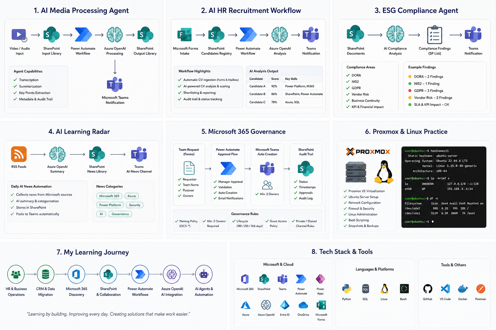

<!-- ========================================================= -->
<!-- README V2.0 -->
<!-- PART 1 -->
<!-- ========================================================= -->

<h1 align="center">
Hi, I'm Denisa Pitnerová 👋
</h1>

<p align="center">
Junior Microsoft 365 • Power Platform • Azure OpenAI • Business Process Automation
</p>

<p align="center">

</p>

<p align="center">
Building practical Microsoft 365 solutions through real projects, continuous learning and documentation.
<br>
Vytvářím praktická řešení postavená na Microsoft 365 prostřednictvím reálných projektů, průběžného učení a dokumentace.
</p>

---

| 🇬🇧 English | 🇨🇿 Česky |
|:-----------|:----------|
| ## About me | ## O mně |
| My journey into IT started in administration, HR and CRM systems. Working with business processes taught me that technology is valuable only when it genuinely helps people. | Moje cesta do IT začala v administrativě, HR a práci s CRM systémy. Díky zkušenostem s firemními procesy jsem zjistila, že technologie mají smysl pouze tehdy, když skutečně pomáhají lidem. |
| Today I focus on Microsoft 365, SharePoint, Power Automate and Azure OpenAI. I build practical solutions that automate repetitive tasks, simplify everyday work and connect multiple Microsoft services into one business process. | Dnes se zaměřuji na Microsoft 365, SharePoint, Power Automate a Azure OpenAI. Stavím praktická řešení, která automatizují opakující se činnosti, zjednodušují každodenní práci a propojují více Microsoft služeb do jednoho firemního procesu. |
| Rather than collecting technologies, I enjoy understanding how processes work and designing solutions that make them more efficient. | Místo sbírání technologií mě baví pochopit fungování procesu a navrhnout řešení, které bude jednodušší, přehlednější a efektivnější. |

---

| 🇬🇧 English | 🇨🇿 Česky |
|:-----------|:----------|
| ## Why Microsoft 365? | ## Proč právě Microsoft 365? |
| What attracted me most to Microsoft 365 is the way individual services work together. SharePoint, Power Automate, Teams, Forms and Azure OpenAI become much more powerful when they are connected into one solution. | Na Microsoft 365 mě nejvíce zaujalo to, jak spolu jednotlivé služby spolupracují. SharePoint, Power Automate, Teams, Forms a Azure OpenAI dávají největší smysl ve chvíli, kdy jsou propojené do jednoho funkčního řešení. |
| Most of my projects are built inside my own Microsoft 365 tenant. It allows me to safely experiment, test new ideas, learn from mistakes and continuously improve each project. | Většinu projektů stavím ve vlastním Microsoft 365 tenantovi. Díky tomu mohu bezpečně experimentovat, testovat nové nápady, učit se z chyb a jednotlivé projekty postupně rozvíjet. |
| Building solutions in my own environment has taught me much more than simply following tutorials. Every project becomes another practical learning experience. | Stavba vlastních řešení mě naučila mnohem více než pouhé sledování návodů. Každý projekt je pro mě další praktickou zkušeností. |

---

| 🇬🇧 English | 🇨🇿 Česky |
|:-----------|:----------|
| ## My approach | ## Jak přemýšlím |
| I don't start with technology. I start with a business problem. Once I understand the process, I look for the best combination of Microsoft 365 services that can simplify it. | Nikdy nezačínám technologií. Začínám problémem nebo procesem. Jakmile pochopím, co je potřeba vyřešit, hledám nejvhodnější kombinaci služeb Microsoft 365, která celý proces zjednoduší. |
| Automation is not the goal. It is a tool that helps people spend less time on repetitive work and more time on meaningful tasks. | Automatizace pro mě není cíl. Je to nástroj, který pomáhá lidem trávit méně času opakujícími se činnostmi a více času prací s vyšší přidanou hodnotou. |

---

## Current Focus

```text
Microsoft 365
        │
        ▼
SharePoint Online
        │
        ▼
Power Automate
        │
        ▼
Microsoft Teams
        │
        ▼
Azure OpenAI
        │
        ▼
AI Process Automation
```

---

> **Technology should simplify people's work, not make it more complicated.**

> **Technologie by měla lidem práci zjednodušovat, ne komplikovat.**

<!-- ========================================================= -->
<!-- README V2.0 -->
<!-- PART 2 -->
<!-- ========================================================= -->

---

| 🇬🇧 English | 🇨🇿 Česky |
|:-----------|:----------|
| ## Learning by Building | ## Učím se stavbou projektů |
| I learn best by building real solutions. Every project starts with a simple idea, grows through experimentation and gradually becomes a more complete solution. | Nejvíce se učím při stavbě reálných řešení. Každý projekt začíná jednoduchým nápadem, pokračuje experimentováním a postupně se rozvíjí do propracovanějšího řešení. |
| I don't expect everything to work on the first attempt. Testing, analysing problems and improving previous versions are a natural part of my work. | Neočekávám, že bude všechno fungovat napoprvé. Testování, hledání příčin problémů a postupné vylepšování předchozích verzí beru jako přirozenou součást práce. |
| Every completed project becomes the foundation for the next one. | Každý dokončený projekt se stává základem pro další verzi nebo nový projekt. |

---

| 🇬🇧 English | 🇨🇿 Česky |
|:-----------|:----------|
| ## What Real Projects Have Taught Me | ## Co mě naučily reálné projekty |

---

### 🤖 AI Media Processing Agent

| 🇬🇧 English | 🇨🇿 Česky |
|:-----------|:----------|
| **Challenge** | **Výzva** |
| During testing I discovered that text-based PDF documents and technical drawings stored as PNG images cannot be processed in the same way. | Během testování jsem zjistila, že textová PDF a technické výkresy uložené jako PNG nelze zpracovávat stejným způsobem. |
| **What I learned** | **Co jsem se naučila** |
| I realised that successful AI processing is not only about choosing the right model but also about understanding the input data. The next version of the project will include a dedicated workflow for technical drawings. | Uvědomila jsem si, že úspěšné AI zpracování není jen o správném modelu, ale také o pochopení vstupních dat. Další verze projektu bude obsahovat samostatné workflow pro technické výkresy. |

---

### 🔄 HR AI Workflow

| 🇬🇧 English | 🇨🇿 Česky |
|:-----------|:----------|
| **Challenge** | **Výzva** |
| The workflow finished successfully, but the AI output was not displayed correctly in SharePoint. | Workflow proběhlo úspěšně, ale AI výstup se nezobrazoval správně v SharePointu. |
| **What I learned** | **Co jsem se naučila** |
| A successful Flow run does not always mean the solution works correctly. I learned how to verify data mapping, SharePoint columns and each step of the workflow separately. | Úspěšně dokončené Flow ještě neznamená správný výsledek. Naučila jsem se ověřovat mapování dat, SharePoint sloupce i jednotlivé kroky workflow samostatně. |

---

### ☁️ Microsoft 365

| 🇬🇧 English | 🇨🇿 Česky |
|:-----------|:----------|
| **Challenge** | **Výzva** |
| Microsoft 365 changes continuously. Some features moved, changed or looked different during my learning journey. | Microsoft 365 se průběžně vyvíjí. Během učení se některé funkce přesunuly nebo změnily svůj vzhled. |
| **What I learned** | **Co jsem se naučila** |
| Instead of relying on old tutorials, I learned to work with current Microsoft documentation, test changes myself and adapt to the evolving platform. | Místo spoléhání na staré návody jsem se naučila pracovat s aktuální dokumentací Microsoftu, změny si sama ověřovat a přizpůsobovat se vývoji platformy. |

---

### 🔄 Power Automate

| 🇬🇧 English | 🇨🇿 Česky |
|:-----------|:----------|
| **Challenge** | **Výzva** |
| Several workflows required multiple redesigns before they behaved as expected. | Některá workflow bylo potřeba několikrát přepracovat, než fungovala podle očekávání. |
| **What I learned** | **Co jsem se naučila** |
| Sometimes taking one step back is faster than trying to fix the wrong approach. Building, testing and redesigning became a natural part of my work. | Někdy je rychlejší vrátit se o krok zpět než dlouho opravovat špatně navržené řešení. Stavba, testování a přepracování návrhu se pro mě staly běžnou součástí práce. |

---

| 🇬🇧 English | 🇨🇿 Česky |
|:-----------|:----------|
| ## Technologies I use most often | ## Technologie, které používám nejčastěji |

| **Daily** | **Každodenní práce** |
| SharePoint Online | SharePoint Online |
| Power Automate | Power Automate |
| Microsoft Teams | Microsoft Teams |
| Microsoft Forms | Microsoft Forms |
| Azure OpenAI | Azure OpenAI |

| **Currently Learning** | **Právě se učím** |
| Power Apps | Power Apps |
| Dataverse | Dataverse |
| Dynamics 365 Fundamentals | Základy Dynamics 365 |
| Microsoft Graph | Microsoft Graph |
| Logic Apps | Logic Apps |

---

| 🇬🇧 English | 🇨🇿 Česky |
|:-----------|:----------|
| ## Documentation Matters | ## Dokumentace je součást projektu |
| I document every project because documentation helps me understand the solution better and makes future improvements much easier. | Každý projekt dokumentuji, protože mi dokumentace pomáhá lépe porozumět řešení a výrazně usnadňuje jeho další rozvoj. |
| Every new version builds on what I learned in the previous one. | Každá další verze projektu vychází z poznatků získaných při té předchozí. |

---
<!-- ========================================================= -->
<!-- README V2.0 -->
<!-- PART 3 -->
<!-- ========================================================= -->
---

# Featured Portfolio Projects

Každý projekt v tomto portfoliu vznikl jako součást mého učení. Nejde o ukázkové příklady z kurzu, ale o vlastní řešení, která průběžně rozvíjím ve svém Microsoft 365 tenantovi.

Each repository in this portfolio represents a real project that I designed, tested and continuously improve inside my personal Microsoft 365 tenant.

---

## 🤖 AI Media Processing Agent

### Goal

Automatizovat zpracování dokumentů pomocí Microsoft 365, SharePoint, Power Automate a Azure OpenAI.

### Technologies

- Microsoft 365
- SharePoint Online
- Power Automate
- Azure OpenAI
- Microsoft Teams

### Current Status

✅ V1 Complete

### What I achieved

- automatické nahrání dokumentu
- registrace dokumentu
- AI shrnutí dokumentu
- klasifikace dokumentů
- metadata
- zápis do SharePoint List
- Teams notifikace

### Biggest learning

Největším přínosem bylo pochopení, že různé typy dokumentů vyžadují odlišný způsob AI zpracování.

Během testování jsem zjistila, že PDF dokumenty a technické výkresy ve formátu PNG nelze zpracovávat stejným workflow.

To mě přivedlo k návrhu nové architektury pro další verzi projektu.

---

## 📄 HR AI Workflow

### Goal

Automatizovat zpracování HR požadavků pomocí Microsoft 365 a Azure OpenAI.

### Technologies

- Microsoft Forms
- SharePoint
- Power Automate
- Azure OpenAI
- Microsoft Teams

### What I achieved

- automatické vytvoření požadavku
- AI shrnutí
- SharePoint evidence
- Teams notifikace
- auditní stopa

### Biggest learning

Zjistila jsem, že úspěšně dokončené Flow ještě nemusí znamenat správný výsledek.

Naučila jsem se kontrolovat mapování dat, SharePoint sloupce a celý tok informací od vstupu až po výstup.

---

## 📰 AI Learning Radar

### Goal

Automaticky sledovat novinky z Microsoft prostředí pomocí RSS, Azure OpenAI a Microsoft Teams.

### Technologies

- RSS
- Power Automate
- SharePoint
- Azure OpenAI
- Microsoft Teams

### What I achieved

- automatické sledování novinek
- AI shrnutí článků
- ukládání do SharePoint
- Teams notifikace

### Biggest learning

Uvědomila jsem si, že automatizace nemusí šetřit jen čas, ale může lidem pomáhat průběžně získávat důležité informace bez nutnosti je aktivně vyhledávat.

---

## 🛡 Compliance Agent

### Goal

Analyzovat dokumenty z pohledu DORA, NIS2, GDPR a Compliance pomocí Azure OpenAI.

### Current Status

🚧 In Progress

### Planned Technologies

- Microsoft 365
- SharePoint
- Azure OpenAI
- Power Automate
- Microsoft Teams

### Planned Output

- Compliance Findings
- AI Recommendations
- Risk Classification
- Audit Trail

---

# What I'm Learning Through These Projects

Každý projekt mě posouvá nejen technicky, ale především v tom, jak přemýšlím nad návrhem řešení.

Postupně jsem zjistila například:

✔ že Microsoft 365 není soubor samostatných aplikací, ale propojený ekosystém

✔ že dokumentace je stejně důležitá jako samotná implementace

✔ že dobře navržená automatizace vzniká postupným testováním

✔ že někdy je rychlejší změnit architekturu řešení než několik hodin opravovat špatný návrh

✔ že AI poskytuje nejlepší výsledky tehdy, když dostane správně připravená vstupní data

✔ že každá další verze projektu je lepší díky zkušenostem získaným při předchozí verzi

---

# Current Focus

Momentálně se zaměřuji především na:

- Microsoft 365
- SharePoint Online
- Power Automate
- Azure OpenAI
- AI Process Automation
- Process Design
- Governance
- Business Workflows

Každý nový projekt stavím jako další krok své profesní cesty.

Ne proto, aby přibylo další portfolio.

Ale proto, abych lépe porozuměla technologiím, které používám.
